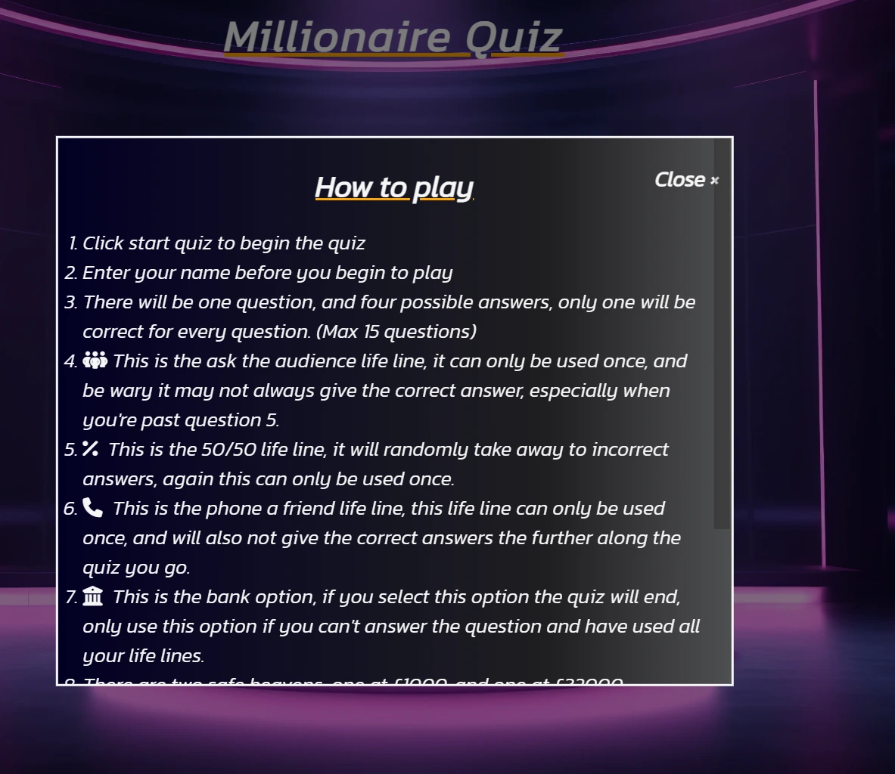

# Millionaire Quiz

------------
[Link to live site here](https://craig-hudson.github.io/Millionaire/  "Link to live site here")

## Table of Contents

- [Millionaire Quiz](#millionaire-quiz)
  - [Table of Contents](#table-of-contents)
  - [Introduction](#introduction)
  - [User Experience (UX)](#user-experience-ux)
    - [User Stories (US)](#user-stories-us)
    - [Design](#design)
    - [Accessability](#accessability)
  - [Features](#features)
    - [Favicon](#favicon)
    - [Home Page](#home-page)
    - [Home Page modals](#home-page-modals)
    - [Input Name Page](#input-name-page)
    - [Game Page](#game-page)
    - [pop up modal messages when user interacts with life lines.](#pop-up-modal-messages-when-user-interacts-with-life-lines)
    - [End Game Page](#end-game-page)
    - [Thank You Page](#thank-you-page)
    - [Footer](#footer)
  - [Technologies Used](#technologies-used)
    - [Languages Used](#languages-used)
    - [Frameworks, Libraries \& Programs Used](#frameworks-libraries--programs-used)
  - [Testing](#testing)
    - [Bugs](#bugs)
  - [Deployment \& Local Development](#deployment--local-development)
    - [Deployment](#deployment)
    - [Local Development](#local-development)
      - [How to Fork](#how-to-fork)
      - [How to Clone](#how-to-clone)
  - [Credits](#credits)
    - [Code Used](#code-used)
    - [Content](#content)
    - [media](#media)
    - [Acknowledgments](#acknowledgments)

## Introduction

Here we have a quiz similar to the game show who wants to be a millionaire, which consists of players
trying to answer up to a maximum of 15 questions, being able to win up to £ 1,000,000.
The app I have constructed will be based on some of the concepts of the game show, including answering up to 15 general knowledge questions, but the user will need to be wary because if they answer a question wrong before the first safe haven at £1000 they could walk away with nothing, and being able to use life lines along the way to help the user answer any questions they may be stuck on. As well as the user being able to keep track of their high scores that will be on the home page.

## User Experience (UX)

### User Stories (US)

- **First time visitor goals**
    1. As a first time visitor I want to be able to easily identify what the purpose of the app is
    2. As a first time visitor I want instructions on how to play the quiz
    3. As a first time visitor I want to be able to easily find where to start the quiz.
    4. As a first time visitor I want to be able to keep track on where I am on the money ladder, with the option to bank money on questions the user may be unsure of.

  - **Returning Visitor goals**
    1. As a returning Visitor I want to be able to keep track of my previous high scores locally.
    2. As a returning Visitor I want the life lines to not always give the correct answers especially on the questions later on in the quiz.
    3. As a returning visitor I want to be able to contact form to provide feedback, or any errors that may occur on the webpage.

  - **Frequent visitor goals**
  - 1. As a frequent visitor I want to be able to keep track of my high score even if I exit the page.
  - 2. As a frequent visitor I want to be able to see the high scores of users from all over the world.

### Design

- I will be using #14213D which is a ~ Indanthrone Blue PC 208 colour, for background colors.
- I will be using #FCA311 which is a ~ Sand PC 940 colour, this will be used on correct answer buttons and also to highlight the score the user is currently on.
- I will be using #000000 and a mix off #E5E5E5 for backgrounds on modals and the colours of the buttons.
  
  - **typography**
  - font-family: 'Kanit', sans-serif; will be used through out all pages titles and ordinary text, its easy to read, It's looks very elegant and clean and it will appeal to users who take part in the quiz.

  - **Structure**
    - The structure of the quiz app consists of a home page which contains a page title, a background image and 4 buttons, Start quiz, how to play, high scores and contact us.The how to play, high scores, and contact us will be a pop on modal on desktop tablet and mobile. The start quiz button will take the user to an area that will require the user to enter their name.Then the quiz area will appear once the user has submitted their name.  The question area will consist of the question area with 4 possible answers, 3 life lines, a bank option,and a money ladder so the user can track their progress. On mobile devices the 3 life lines, bank option and money ladder will be hidden in a side panel which can pop out for the user to be able to view and track their progress, along side being able to user the 3 life lines and bank option.

  - **Imagery**
    - I have only used one image for the webpage thus far. which was taken from [Vecteezy](https://www.vecteezy.com/), and is used through out the quiz app as the background image. 

  - **Please note, during the development process I felt the need to replace the logo with a background image, as I felt the app was lacking a visual presence.**

  - **Wireframes**

 [View wire frames here](./assets/images/wireframe-images/)

### Accessability

I have been attentive to make the website as accessible-friendly as possible through the following measures:

- Utilizing semantic HTML to provide meaningful structure and enhance accessibility.
- Incorporating descriptive alt attributes for images on the site to provide alternative text for screen readers.
- I also tested my website using wave which reports back to me any errors/contrast errors that may occur.
  
By implementing them few points above I have made my webpage as accessible and user friendly as possible taking into account those who may be visually impaired and require screen readers for assistance.

## Features

- The Millionaire quiz contains the homepage, which has 4 buttons and a title, the buttons consist of
  start quiz, how to play, high scores and contact us. The high scores button will display a pop up
  modal to display the users high scores that will be saved in local storage and the highs scores will be ranked from highest to lowest.
  The how to play section again will be a pop up modal which has an overflow scroll to display the
  rules of the game to the user.
  The contact us button again will be a pop up modal which will give the user the chance to fill in a form, to contact if they encounter any problems with the game, or any general enquires.
  The start quiz button will then redirect the user to the quiz game page, which consists of the scores which also has the life lines for the user to interact with, this section runs down the left side of the page, and then the quiz area next to it, which consists of the page title, a home button, the quiz questions and answers.
  For mobile users the scores and the lifelines will be hidden in a side panel, which the user will be able to interact with for the user to view their score and use the lifelines.
  Then when the quiz is over the user will be taken to the end game section, which will display messages based on how the user has performed, and then give the user the chance to either play again, or return home to view their high scores, or to be able to contact us if any issues arise.

### Favicon

- A favicon in the browser tab
  

### Home Page

### Home Page modals

- How to play Modal has a scroll effect to fit the content in, and thats fors desktop, tablet and mobile, and will then list and give the user information on how to play the quiz.

- High Score Modal will store the high scores of the user, I have used local storage to achieve this, so the user will be able to view their own high scores, high scores are also listed highest to lowest and if the user scores higher and they've reached the maximum amount of high scores (50), the lowest score will be replaced and the newer high score added into the high score display.

- Contact us Modal a simple for for the user to fill in for any general enquires and any bugs/errors found, which will then take the user to a thank you page.

### Input Name Page

- Input Name Section

### Game Page

- Game Page
  

### pop up modal messages when user interacts with life lines.

- Phone a friend pop up

- Ask the Audience

### End Game Page

- End Game Section
- The end game section will display a message to the user depending on how the user has performed on the quiz, which also includes the score the user achieved on the quiz, and then the options to play again or return home to be able to view their high scores.
- 

### Thank You Page

-Thank You Page

### Footer

- A footer at the bottom of the page with the copyright and navigation links for social networks

## Technologies Used

### Languages Used

HTML, CSS and JavaScript have been used for this project.

### Frameworks, Libraries & Programs Used

Git - For version control.
​

[Github](https://github.com/Craig-Hudson) - To save and store the files for the website.

​
[Google Fonts](https://fonts.google.com/) - To import the fonts used on the website.

​
[Font Awesome](https://fontawesome.com/) - For the iconography on the website.

​Chrome Dev Tools - To troubleshoot and test features, solve issues with responsiveness and styling.

[Convert png to webp](https://www.freeconvert.com/) - I converted my images to webp using this site.

[tiny.png](https://tinypng.com/) - To reduce the file size of my images for better website performance

[Image resizer](https://www.resizepixel.com/) - To reduce any unnecessary height and width on photos, also minimizing file size.

Balsamiq - I used Balsamiq wireframes from a desktop app for my wireframes,

[W3School](https://www.w3schools.com/) To refer to anything Java script related that i may have been unsure of.

[Vecteezy](https://www.vecteezy.com/) - I used this website to get the image for my background

VsCode - I have used vscode as my ide

[open trivia db](https://opentdb.com/) - I used this database for the api's used for the quiz.

## Testing

All my testing can be found in the [testing file](testing.md)

### Bugs

- **Solved Bugs**

| Bug found  | How I resolved  |
| ------------ | ------------ |
| Hover effect on answer buttons not working on firefox desktop browser  | I had a media query that stopped the hover effect for touchscreen devices, but this was also effecting desktop on firefox browsers. So I put this media query into the media query for screens that are less than 800px so desktop users on firefox can see the hover effect.  |
|  Phone a friend life line not displaying correct messages | It seem the issue was with my initial conditional statements comparing the score, which was outputting correctly in the function with many of console logs, but didn't work, so i adjusted the conditional to compare the moneyIndex and now all the messages are outputting as expected  |
| Banking on mobile devices asked user for confirmation twice  | I couldnt find anything in the javascript causing the issue, the function wasn't being called twice, so I checked the html, and I noticed I had the class bank twice which in effect caused the confirmation two execute twice.  |
| When I click on the home button and click no, and then goto click a life line the option to return home or stay on the game page are still there.  | Simple fix of add the class of hidden in the closeModal function to hide the yes or no buttons when the modal is closed.  |

- **Known Bugs**

Currently There is no known bugs

## Deployment & Local Development

### Deployment

Github Pages was used to deploy the live website. The instructions to achieve this are below:
​

1. Log in (or sign up) to Github.
2. Find the repository for this project here > [Millionaire](<https://github.com/Craig-Hudson/Millionaire>)
3. Click on the Settings link.
4. Click on the Pages link in the left hand side navigation bar.
5. In the Source section, choose main from the drop down select branch menu. Select Root from the drop down select folder menu.
6. Click Save. Your live Github Pages site is now deployed at the URL shown.
​

### Local Development

#### How to Fork

​
To fork The Millionaire repository:
​

1. Log in (or sign up) to Github.
2. Go to the repository for this project, Millionaire !(<https://github.com/Craig-Hudson/Millionaire.git>)
3. Click the Fork button in the top right corner.
​

#### How to Clone

​
To clone The Millionaire repository:
​

1. Log in (or sign up) to GitHub.
2. Go to the repository for this project.
3. Click on the code button, select whether you would like to clone with HTTPS !(<https://github.com/Craig-Hudson/Millionaire.git>) and copy the link shown.
4. Open the terminal in your code editor and change the current working directory to the location you want to use for the cloned directory.
5. Type 'git clone' into the terminal and then paste the link you copied in step 3. Press enter.
​

## Credits

### Code Used

- Most of the code in this project was written my myself, references to w3schools and mdn web docs have been made with some of the code also, weather thats remembering a syntax, or re jogging my memory.

- I had to take code from the following sources below.

- I had to use the fisher yates shuffle to shuffle my answers I took the code from [Geeks For Geeks](https://www.geeksforgeeks.org/shuffle-a-given-array-using-fisher-yates-shuffle-algorithm/)

- The code from the function below tas taken from [Stack Overflow](https://stackoverflow.com/questions/6555182/remove-all-special-characters-except-space-from-a-string-using-javascript)

- The code for both of these functions which are used for getting the users scores into local storage was used by using a video tutorial from this [youtube tutorial](https://www.youtube.com/watch?v=DFhmNLKwwGw&list=PLDlWc9AfQBfZIkdVaOQXi1tizJeNJipEx&index=9)

### Content

The use of the information which I used for the sanitizeAnswer function which I used some of the code from an stack overflow post and the high score local storage functions in the game.js and home.js files which I used a youtube tutorial for.
The use of w3schools for any prompts for any syntax I may of needed a reminder off.

The other content for this project was written by Craig Hudson

### media

- All Images for the site were all taken from [vecteezy](https://www.vecteezy.com/)

### Acknowledgments

I would like to acknowledge the following people who helped me along the way in completing this project:

- My code institute mentor Narender Singh for feedback and he many ways I can improve.
- My partner for having the patience with me and allowing me more time to work on projects.
- My fellow classmates Ross and dan for any hints and tips that they have given me over the last few weeks.
- Other family who have helped test my quiz application and given me constructive feedback, and ideas that I would be able to improve the quiz application