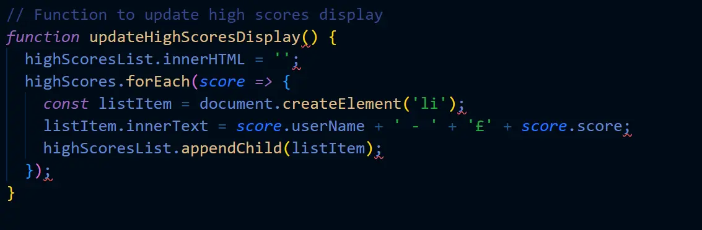

# Millionaire Quiz Testing

## Table of contents

- [Millionaire Quiz Testing](#millionaire-quiz-testing)
  - [Table of contents](#table-of-contents)
  - [Overview](#overview)
  - [Automated Testing](#automated-testing)
    - [Lighthouse](#lighthouse)
    - [HTML validator](#html-validator)
    - [CSS validator](#css-validator)
    - [JavaScript Validator](#javascript-validator)
  - [wave reports](#wave-reports)
  - [Manual Testing](#manual-testing)
    - [Testing user Stories](#testing-user-stories)
  - [Bugs](#bugs)

## Overview

I used test driven development throughout the entire build for this project.
This includes using chrome developer tools to test for responsiveness and for general positioning of elements, I also used the dev tools for my JavaScript to help identify where any issues were arising from so they could be corrected before moving on.

## Automated Testing

### Lighthouse

- Desktop Lighthouse report perfect scores all round!

- Mobile lighthouse report 

### HTML validator

- Index html page has zero warning or errors

- Quiz html has zero warnings or errors
  

- Thank you html has zero warnings or errors

- 404 html has zero warnings or errors

- 500 html has zero warnings or errors

### CSS validator

- My css has come back with no errors and no warnings.

### JavaScript Validator

- Home page JavaScript validation on JShint

- Game page javascript validation on JShint

## wave reports

- Home page

- Quiz page

- Thank you page

- 404 page

- 500 page

- All the wave reports have zero errors and zero contrast errors, a few of them have alerts for possible headings and adjacent links.

## Manual Testing

### Testing user Stories

- **First time Visitors**

|  Goals | How are they achieved?  |
| ------------ | ------------ |
| As a first time visitor I want to be able to easily identify what the purpose of the app is |  This was achieved by displaying a title to the main home page, that specially says quiz in, a button that says start quiz, and in the how to play modal, clearing stating on how to play the quiz |
|  As a first time visitor I want instructions on how to play the quiz | This was achieved by creating a pop up modal for both desktop and mobile, to display the rules on how to play the quiz game. |
| As a first time visitor I want to be able to easily find where to start the quiz.  | This was achieved by creating a start quiz button clearly visible on the home page.  |
| As a first time visitor I want to be able to keep track on where I am on the money ladder, with the option to bank money on questions the user may be unsure of.  | On desktop version of the game the user will be able to view the money ladder to the left side of the page that will be highlighted in orange to show the user where they are up to along with the bank life line clearly visible above the scores, and on devices less than 800px in width, will have a side bar that can toggle in and out to view and track their progress along with after each question being correctly answered, the side bar will automatically pop out and back in again, so the user can see where they are up to. |

- **Returning Visitor Goals**

| Goals  |  How are they achieved? |
| ------------ | ------------ |
| As a returning Visitor I want to be able to keep track of my previous high scores locally.  | This was achieved by ensuring that when the quiz ends the users score(money) is saved and logged into the high scores function, which is then transmitted over to the high scores modal on the home page for the user to see.  |
| As a returning Visitor I want the life lines to not always give the correct answers especially on the questions later on in the quiz. |  This was achieved by having the phone a friend and ask the audience life lines after question 5 giving the user a couple of different options for them to choose from. In the ask the audience, two answers will be shown in percentages of what the audience voted for and shown to the user, these percentages are randomized, and the phone a friend life line after question 5 will give the user a couple of options to choose from, and question 10 and over the user will only receive one random answer from the four possible answers. |
​| As a returning visitor I want to be able to contact form to provide feedback, or any errors that may occur on the webpage. |  This was achieved by creating a contact form thats on the home page, again it is a modal, and the form once submitted will take the user to a thank you for submitting page. |  
​

- **Frequent visitor goals**

|  Goals | How are they achieved  |
| ------------ | ------------ |
| As a frequent visitor I want to be able to keep track of my high score even if I exit the page.  | This was achieved by creating a function that will save the users name and high score into local storage so when the user returns to the website even after closing the webpage the users scores will always be there.  |
| As a frequent visitor I want to be able to see the high scores of users from all over the world.  | Unfortunately this was not achieved in this project, but this will be something I will be looking to add in any future development, once I learn the backend and databases.  |

*** Full Testing

Testing was done on the following devices and browsers

- Devices
  - Lenovo Laptop 14inch screen
  - oppo xp lite (android)

- Browsers
  - Google chrome
  - Firefox

-**Home Page**

| Feature  | Expected outcome  | Testing performed  | Result  | Pass/Fail  |
| ------------ | ------------ | ------------ | ------------ | ------------ |
| Start Quiz Button  | To take the user to quiz html page / input name section  | Click button  | Took user to quiz.html / input name section | Pass  |
|  How to play button / modal | Modal to pop up with a scroll effect added   | Click how to play button  | modal pops up  | pass  |
| High score button / modal  | high score modal to pop up  | Click high score button  | Modal popped up  | Pass  |
| contact us button / modal  | Modal to pop up  | Click contact us modal  | Modal popped up  | Pass  |
|  Close modal | Modal to close when clicked on close, any part of the window outside the modal and for modals to close when escape key pressed  | Click, key press  | all 3 modals closed when I clicked close in the modal, closed when I clicked outside the modal, and closed when I pressed the escape key  |   |
| High scores | High scores to display highest to lowest with users name.   | Played the quiz a couple of times to show high scores being displayed  | High scores display with the users name  | Pass  |
| social media icon links  | To open a new tab and link the user to the relevant webpage  | Click each of the three icons  | All three social media icons opened new tabs, and directed me to the correct webpage  | Pass  |
| Contact form required fields test  | If the user fails to fill in any of the fields, it will alert the user that a certain field is required to fill in.  | miss parts of the form out  | If any of the the fields were missed it alerted me that they were required to fill in to send the form  | Pass  |
| Submit button form  | To take user to a thank you page   | Click submit button  | I was always taken to the thank you page.  | Pass  |

- **Quiz Page - Input Name Section**

| Feature  | Expected outcome  | Testing performed  | Result  | Pass/Fail  |
| ------------ | ------------ | ------------ | ------------ | ------------ |
|  Validation between 4-12 Characters | Error message to pop up to warn user that they are required to enter between 4-12 characters  | Enter less than 4 and more than 12 Characters  | Error message popped up to warn user  | Pass  |
| submit button  | Taken the the quiz area  | Click submit  | I was taken to the quiz area section  | Pass   |

## Bugs
