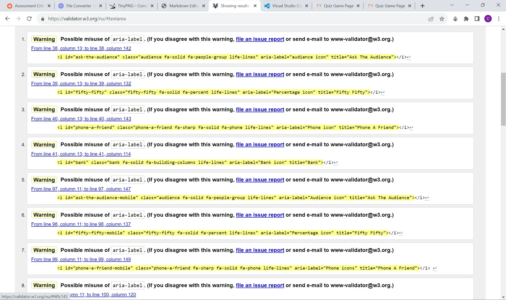

# Millionaire Quiz Testing

## Table of contents

- [Millionaire Quiz Testing](#millionaire-quiz-testing)
  - [Table of contents](#table-of-contents)
  - [Automated Testing](#automated-testing)
    - [Lighthouse](#lighthouse)
    - [HTML validator](#html-validator)
    - [CSS validator](#css-validator)
    - [JavaScript Validator](#javascript-validator)
  - [Manual Testing](#manual-testing)
  - [Bugs](#bugs)

## Automated Testing

### Lighthouse

### HTML validator

- Index.html page has zero warning or errors

- Quiz.html has 8 warnings for possible misuse of aria-label, which I have chosen to ignore as for the context of which I use the icons with the aria-label to display the life lines I feel they would be useful.
  

### CSS validator

- My css has come back with no errors and no warnings.

### JavaScript Validator

- Home page JavaScript validation on JShint

- Game page javascript validation on JShint

## Manual Testing

## Bugs
