# Millionaire Quiz Testing

## Table of contents

- [Millionaire Quiz Testing](#millionaire-quiz-testing)
  - [Table of contents](#table-of-contents)
  - [Overview](#overview)
  - [Automated Testing](#automated-testing)
    - [Lighthouse](#lighthouse)
    - [HTML validator](#html-validator)
    - [CSS validator](#css-validator)
    - [JavaScript Validator](#javascript-validator)
  - [wave reports](#wave-reports)
  - [Manual Testing](#manual-testing)
    - [Testing user Stories](#testing-user-stories)
    - [Full Testing](#full-testing)

## Overview

I used test driven development throughout the entire build for this project.
This includes using chrome developer tools to test for responsiveness and for general positioning of elements, I also used the dev tools for my JavaScript to help identify if there was any errors in the console and where the issues may of been arising from.

Console.logs and Alerts were used during the development to test the functionality and ensure things like event Listeners were working as expected, or any functions that have conditionals were correctly working. I have added some evidence of this in a small table below.

| What was tested | Description  | Evidence  |
|--------|----------|
| Event Listeners  | For all of my event listeners that required the user to click or key press I used alerts to tell me that I had set up the event listener correctly  | 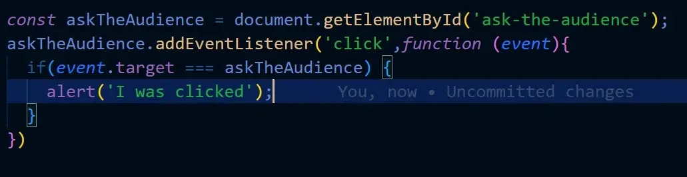 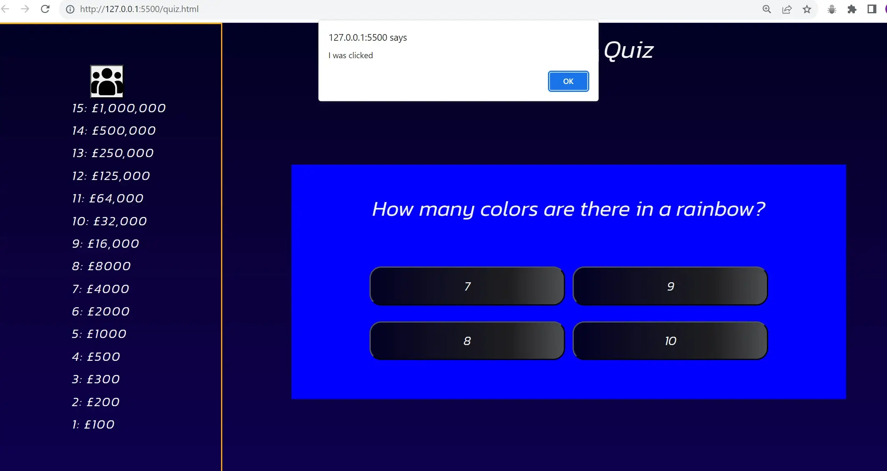  |
| Ask the audience function  | For this function I used a mix of console.logs to double check the data from the api's, and then using alerts in the if statements to test if the conditional statements were correct.   | 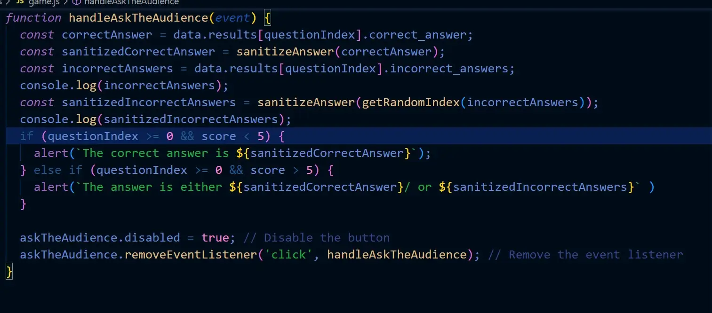  |
| Bank function  | For this function again I used a mix of console logs to check if the data was correct, and then alerts to check if the event listener was correctly working  | 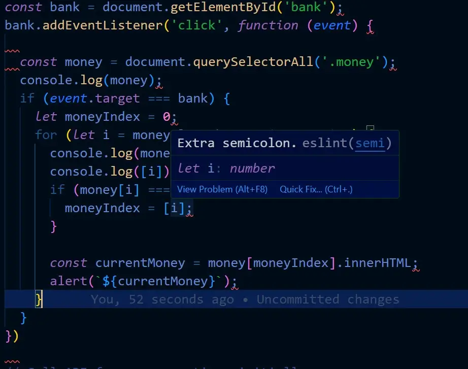  |
| Console logs in chrome dev tools  | Evidence of the use of dev tools and using the console to show me the question and correct answers from the api, and the actual api itself | 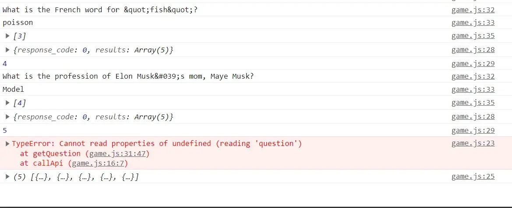  |

## Automated Testing

### Lighthouse

- Desktop Lighthouse report perfect scores all round!

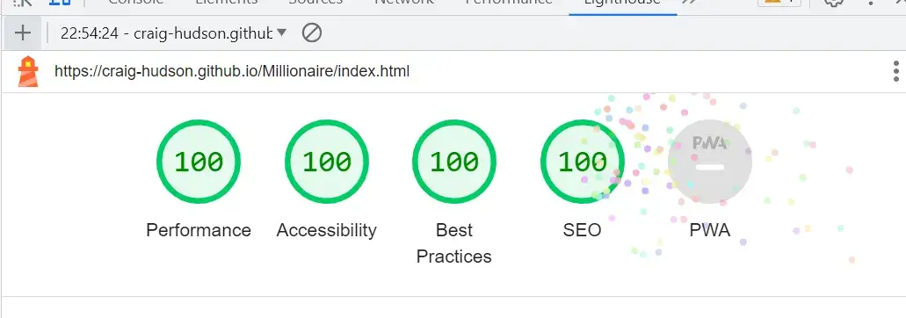

- Mobile lighthouse report 

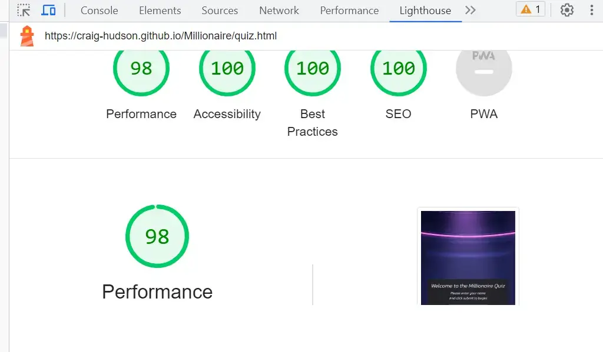

### HTML validator

- Index html page has zero warning or errors

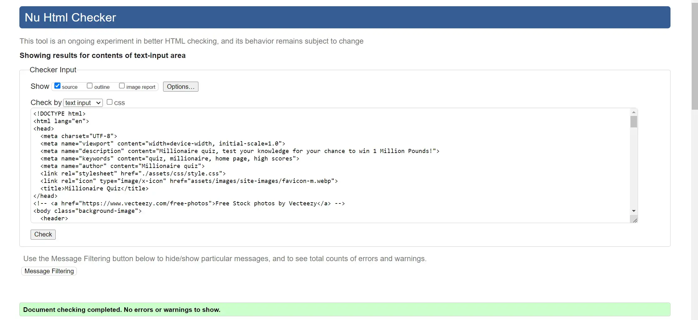

- Quiz html has zero warnings or errors
  
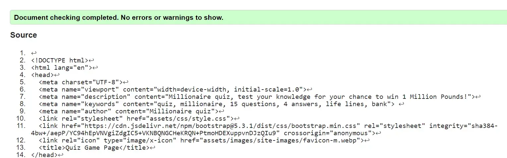

- Thank you html has zero warnings or errors

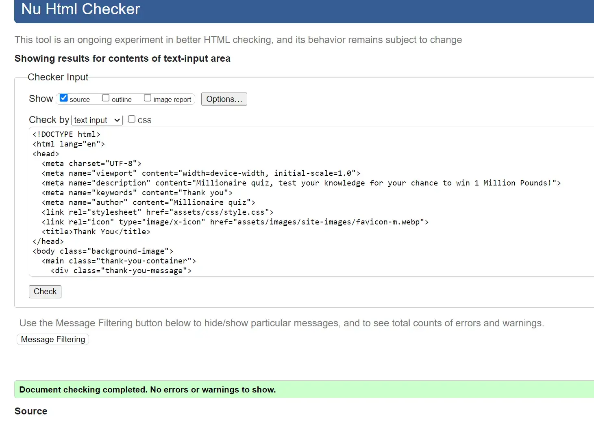

- 404 html has zero warnings or errors

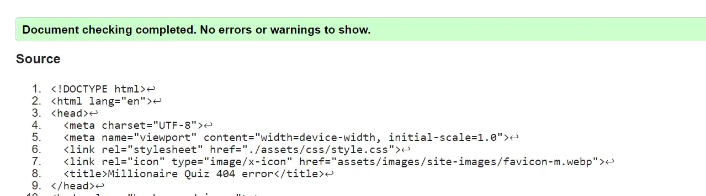

- 500 html has zero warnings or errors

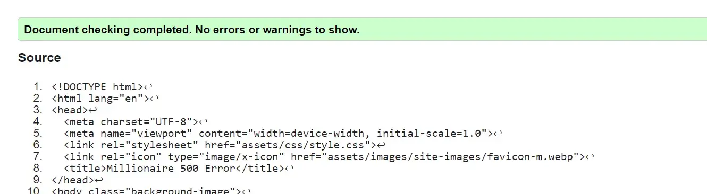

### CSS validator

- My css has come back with no errors and no warnings.

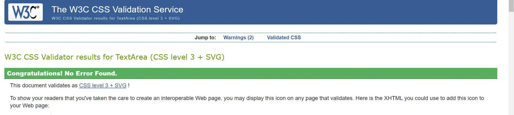

### JavaScript Validator

- Home page JavaScript validation on JShint

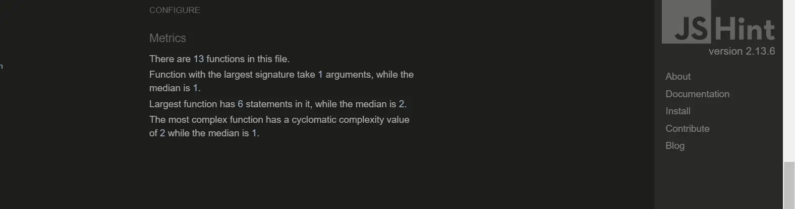

- Game page javascript validation on JShint

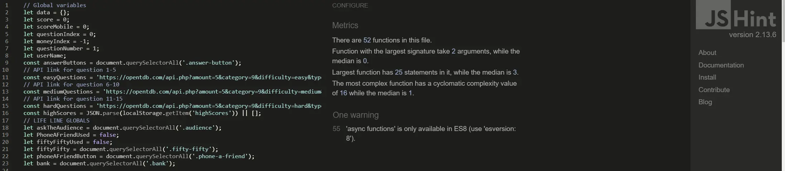

## wave reports

- Home page

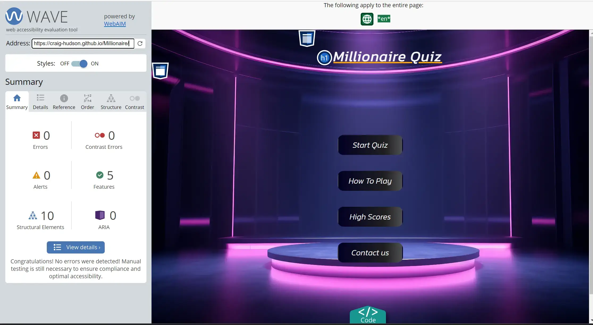

- Quiz page

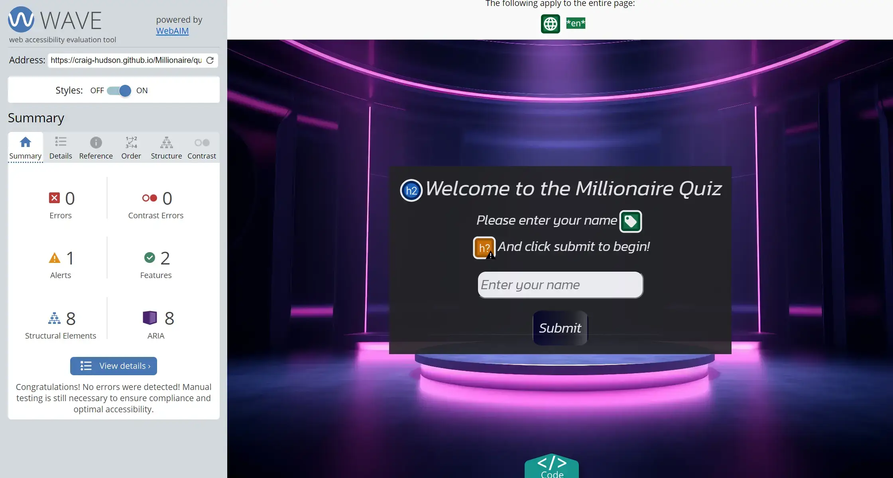

- Thank you page

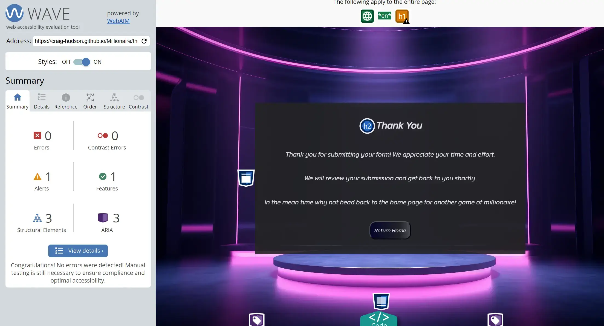

- 404 page

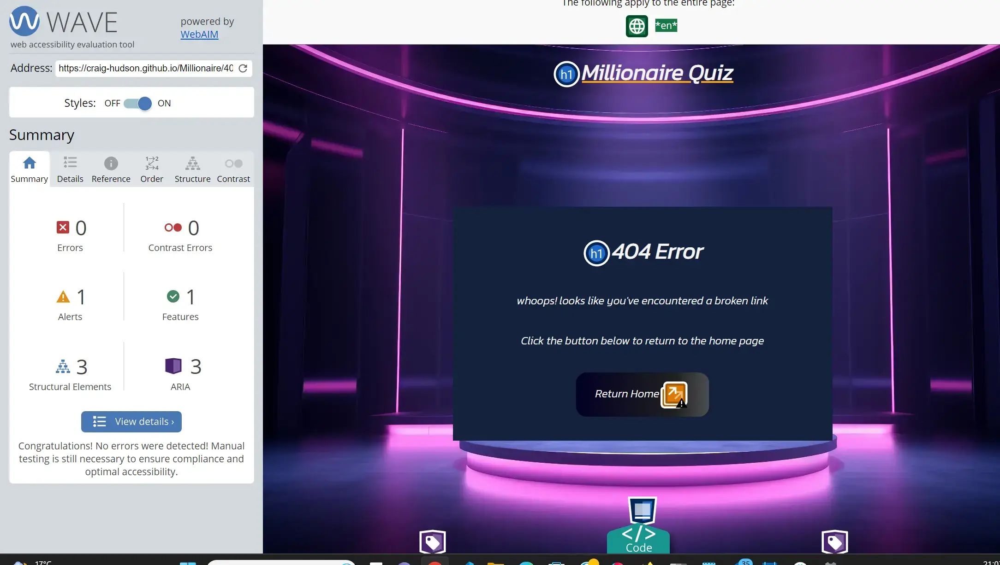

- 500 page

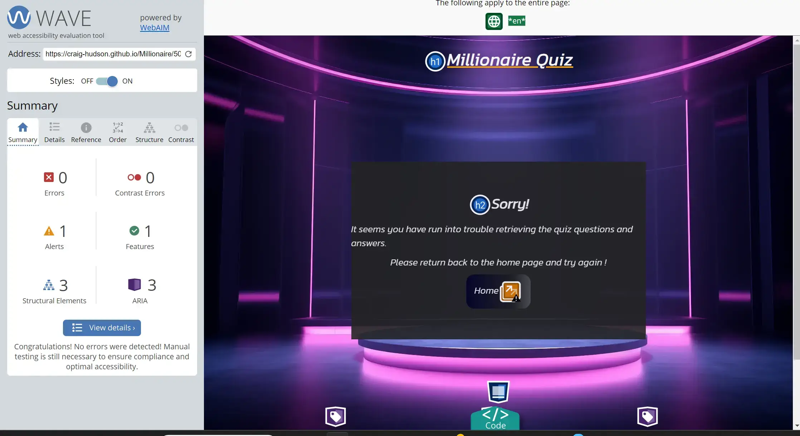

- All the wave reports have zero errors and zero contrast errors, a few of them have alerts for possible headings and adjacent links.

## Manual Testing

### Testing user Stories

- **First time Visitors**

|  Goals | How are they achieved?  |
| ------------ | ------------ |
| As a first time visitor I want to be able to easily identify what the purpose of the app is |  This was achieved by displaying a title to the main home page, that specially says quiz in, a button that says start quiz, and in the how to play modal, clearing stating on how to play the quiz |
|  As a first time visitor I want instructions on how to play the quiz | This was achieved by creating a pop up modal for both desktop and mobile, to display the rules on how to play the quiz game. |
| As a first time visitor I want to be able to easily find where to start the quiz.  | This was achieved by creating a start quiz button clearly visible on the home page.  |
| As a first time visitor I want to be able to keep track on where I am on the money ladder, with the option to bank money on questions the user may be unsure of.  | On desktop version of the game the user will be able to view the money ladder to the left side of the page that will be highlighted in orange to show the user where they are up to along with the bank life line clearly visible above the scores, and on devices less than 800px in width, will have a side bar that can toggle in and out to view and track their progress along with after each question being correctly answered, the side bar will automatically pop out and back in again, so the user can see where they are up to. |

- **Returning Visitor Goals**

| Goals  |  How are they achieved? |
| ------------ | ------------ |
| As a returning Visitor I want to be able to keep track of my previous high scores locally.  | This was achieved by ensuring that when the quiz ends the users score(money) is saved and logged into the high scores function, which is then transmitted over to the high scores modal on the home page for the user to see.  |
| As a returning Visitor I want the life lines to not always give the correct answers especially on the questions later on in the quiz. |  This was achieved by having the phone a friend and ask the audience life lines after question 5 giving the user a couple of different options for them to choose from. In the ask the audience, two answers will be shown in percentages of what the audience voted for and shown to the user, these percentages are randomized, and the phone a friend life line after question 5 will give the user a couple of options to choose from, and question 10 and over the user will only receive one random answer from the four possible answers. |
​| As a returning visitor I want to be able to contact form to provide feedback, or any errors that may occur on the webpage. |  This was achieved by creating a contact form thats on the home page, again it is a modal, and the form once submitted will take the user to a thank you for submitting page. |  
​

- **Frequent visitor goals**

|  Goals | How are they achieved  |
| ------------ | ------------ |
| As a frequent visitor I want to be able to keep track of my high score even if I exit the page.  | This was achieved by creating a function that will save the users name and high score into local storage so when the user returns to the website even after closing the webpage the users scores will always be there.  |
| As a frequent visitor I want to be able to see the high scores of users from all over the world.  | Unfortunately this was not achieved in this project, but this will be something I will be looking to add in any future development, once I learn the backend and databases.  |

### Full Testing

Testing was done on the following devices and browsers

- Devices
  - Lenovo Laptop 14inch screen
  - oppo xp lite (android)

- Browsers
  - Google chrome
  - Firefox

-**Home Page**

| Feature  | Expected outcome  | Testing performed  | Result  | Pass/Fail  |
| ------------ | ------------ | ------------ | ------------ | ------------ |
| Start Quiz Button  | To take the user to quiz html page / input name section  | Click button  | Took user to quiz.html / input name section | Pass  |
|  How to play button / modal | Modal to pop up with a scroll effect added   | Click how to play button  | modal pops up  | pass  |
| High score button / modal  | high score modal to pop up  | Click high score button  | Modal popped up  | Pass  |
| contact us button / modal  | Modal to pop up  | Click contact us modal  | Modal popped up  | Pass  |
|  Close modal | Modal to close when clicked on close, any part of the window outside the modal and for modals to close when escape key pressed  | Click, key press  | all 3 modals closed when I clicked close in the modal, closed when I clicked outside the modal, and closed when I pressed the escape key  |   |
| High scores | High scores to display highest to lowest with users name.   | Played the quiz a couple of times to show high scores being displayed  | High scores display with the users name 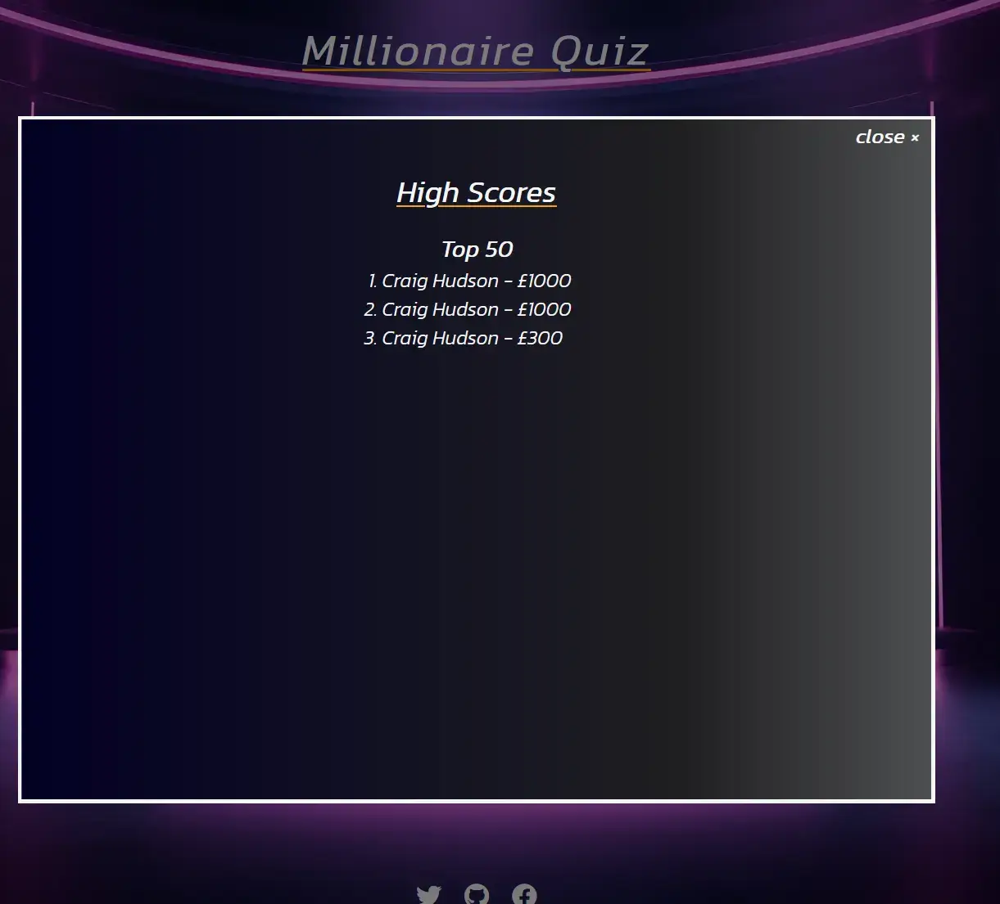 | Pass  |
| social media icon links  | To open a new tab and link the user to the relevant webpage  | Click each of the three icons  | All three social media icons opened new tabs, and directed me to the correct webpage  | Pass  |
| Contact form required fields test  | If the user fails to fill in any of the fields, it will alert the user that a certain field is required to fill in.  | miss parts of the form out  | If any of the the fields were missed it alerted me that they were required to fill in to send the form  | Pass  |
| Submit button form  | To take user to a thank you page   | Click submit button  | I was always taken to the thank you page.  | Pass  |

- **Quiz Page - Input Name Section**

| Feature  | Expected outcome  | Testing performed  | Result  | Pass/Fail  |
| ------------ | ------------ | ------------ | ------------ | ------------ |
|  Validation between 4-12 Characters | Error message to pop up to warn user that they are required to enter between 4-12 characters  | Enter less than 4 and more than 12 Characters  | Error message popped up to warn user  | Pass  |
| submit button  | Taken the the quiz area  | Click submit  | I was taken to the quiz area section  | Pass   |

- **Quiz Page - Game Area**

| Feature  | Expected outcome  | Testing performed  | Result  | Pass/Fail  |
| ------------ | ------------ | ------------ | ------------ | ------------ |
| Correct answer button highlights orange  | Answer button to highlight orange  | Click answer  | Correct answer highlighted  | pass  |
| incorrect answer to highlight red, and show user correct answer by highlighting orange  | incorrect answer red, correct answer orange  | Click incorrect answer  | incorrect answer was red, and correct answer was orange  | pass  |
| money ladder to highlight orange to show user the current score on the money ladder when they answer correctly  | score to highlight answer  | Click correct answer  | The score on the money ladder highlighted  | pass  |
| money ladder to increment and highlight their current score | example the user is on £100 on the money ladder, if the user gets the next question correct the highlight will be taken off £100 and put onto £200  | Answer next question correctly  | The highlight was taken off £100 and put onto £200  | pass  |
| MOBILE USERS side bar for score and life lines open / close  | When user slicked the side bar toggle it should pop out  | Click side bar toggle  | Side bar opened and closed | Passed  |
|  Mobile Users side bar to pop out and back in again automatically when answered question correctly | Side toggle to pop out automatically  | Answer question correctly  | Side toggle opened and gave enough time for the user to see their score   | Pass  |
| Home button  | Ask the user if they want to leave the page  | Click button  | I was asked if i wanted to leave the page, as much progress would be lost.  | Pass  |
| Hover effect on answer buttons  | When hovered over the borders should go orange, and the button should grow slightly in size, this is for desktop only.  | Hover over answer buttons   | All answer buttons grew in size and border colours changed to orange.  | Pass  |
| Hover effect on life lines  | When hovered over the life lines should grow in size and turn orange  | Hover over life line icons  | All icons grew in size, and turned orange while hovered over  | Pass  |
| pop up message when ask the audience and phone a friend life lines are clicked  | Message to pop up  | Click both ask the audience and phone a friend  | pop up messages on both life lines popped up  | Pass  |
| Fifty fifty life line  | Hide two answer buttons  | Click fifty fifty lifeline  | Two answers hid from the users screen, this was testing on multiple questions and answers from each of the three api's  | Pass  |
|  Bank icon | Ask user if they are sure they want to bank, and then exit the quiz to end game section where user messages are displayed.  | Click on bank life line  | I was asked if I wanted to bank, and then upon clicking on yes I was directed to another page where there was a message displaying what I had won. | Pass  |
| Api testing (easy)  | Questions 1-5 should have the easy api  | go through questions 1-5 using console.logs to determine the correct api is in place  | The console.log showed throughout that the easy api was in place 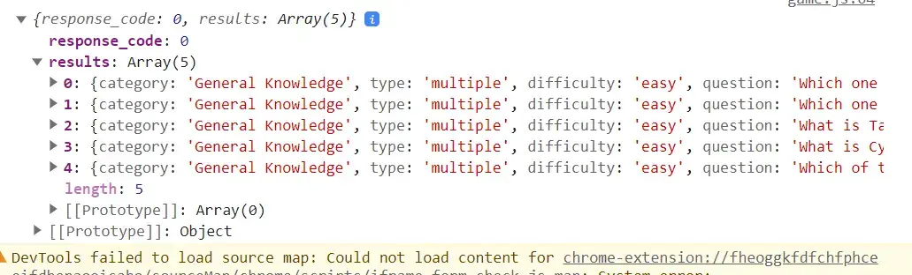   | Pass   |
|  Api testing (medium) | Questions 6-10 should have the medium api  | go through questions 6-10 using console.logs to determine the correct api is in place  | The console.log showed throughout that the medium api was in place 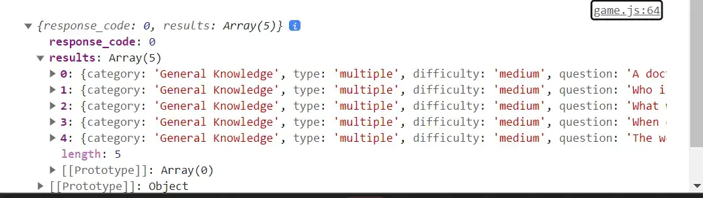    | Pass  |
| Api testing (hard)  | Questions 11-15 should have the hard api   | go through questions 11-15 using console.logs to determine the correct api is in place   | The console.log showed throughout that the hard api was in place 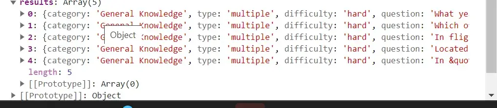   | Pass  |
| Quiz ending  | The quiz should end in the following three events, the user answers a question in correctly, the user banks their money, or the user wins the quiz  | Answer incorrectly, bank my money, and win the quiz  | When I answered a question incorrect the quiz ended, When I banked my money the Quiz ended, When I won the quiz the quiz ended.  | Pass  |
| Safe haven  | Example user is on question 9 and £16,000 if user answers incorrect they will only win £1000 unless they bank The two safe havens are set when user answer question 5 and 10 £1000, and £32,000 | Answer incorrectly too test both safe havens are working as expected  | Both safe havens worked as expected, I answer question incorrect and question 6, 7, 12, and 13  | Pass  |

- **Quiz page - End game section**
| Feature  | Expected outcome  | Testing performed  | Result  | Pass/Fail  |
| ------------ | ------------ | ------------ | ------------ | ------------ |
| Correct username being displayed  | Whatever the user entered as the username to be displayed in the end game message  | Add my username in the input section  | My name was correctly displayed  | Pass  |
| Correct score being displayed  | The users score being displayed in the message  | PLay quiz and check score before ending the quiz  | Every time the score I scored, was the score being displayed in the end game message  | Pass  |
| Play again button  | Return to input name section  | CLick button  | Taken to input name section  | Pass  |
| Return home button  | Return to the home page  | Click button  | Taken to the home page  | Pass  |

- **Thank you page**
| Feature  | Expected outcome  | Testing performed  | Result  | Pass/Fail  |
| ------------ | ------------ | ------------ | ------------ | ------------ |
| Quiz title link to home page  | Take user back to home page  | Click title  | Taken back to home page  | Pass  |
|  Return home button | Take user back to home page  | Click button  | Taken back to home page  | Pass  |
| social media links, to open in new tab  | All 3 social media links in the footer should open in a new tab  | Click social media icons  | All three icons opened in separate tabs  | Pass  |

- **404 Error Page**
| Feature  | Expected outcome  | Testing performed  | Result  | Pass/Fail  |
| ------------ | ------------ | ------------ | ------------ | ------------ |
| Quiz title link to home page  | Take user back to home page  | Click title  | Taken back to home page  | Pass  |
|  Return home button | Take user back to home page  | Click button  | Taken back to home page  | Pass  |
| social media links, to open in new tab  | All 3 social media links in the footer should open in a new tab  | Click social media icons  | All three icons opened in separate tabs  | Pass  |

- **500 Error page**
  
| Feature  | Expected outcome  | Testing performed  | Result  | Pass/Fail  |
| ------------ | ------------ | ------------ | ------------ | ------------ |
| Quiz title link to home page  | Take user back to home page  | Click title  | Taken back to home page  | Pass  |
|  Return home button | Take user back to home page  | Click button  | Taken back to home page  | Pass  |
| social media links, to open in new tab  | All 3 social media links in the footer should open in a new tab  | Click social media icons  | All three icons opened in separate tabs  | Pass  |

